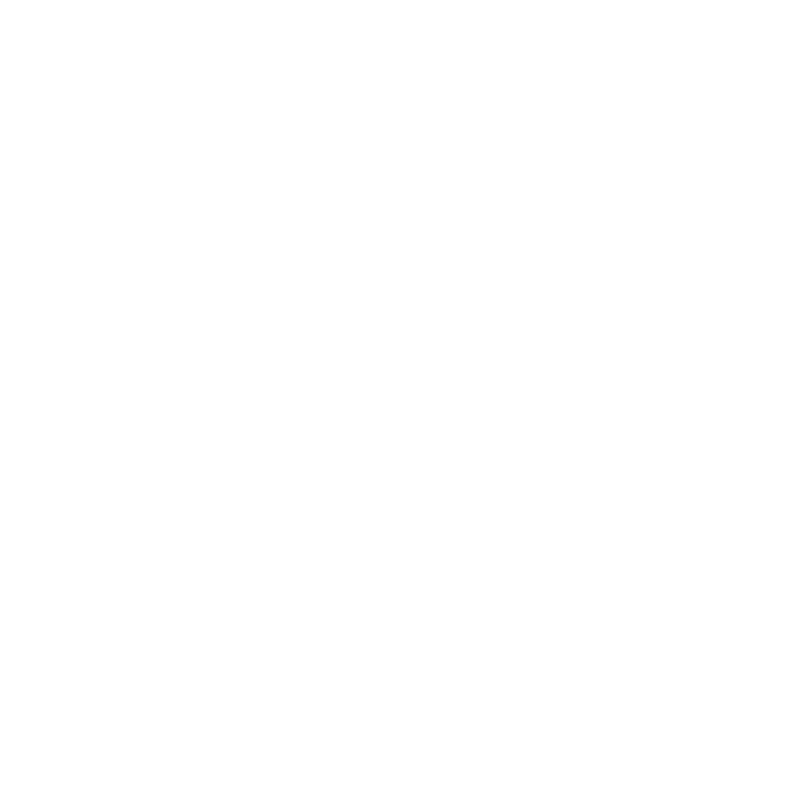
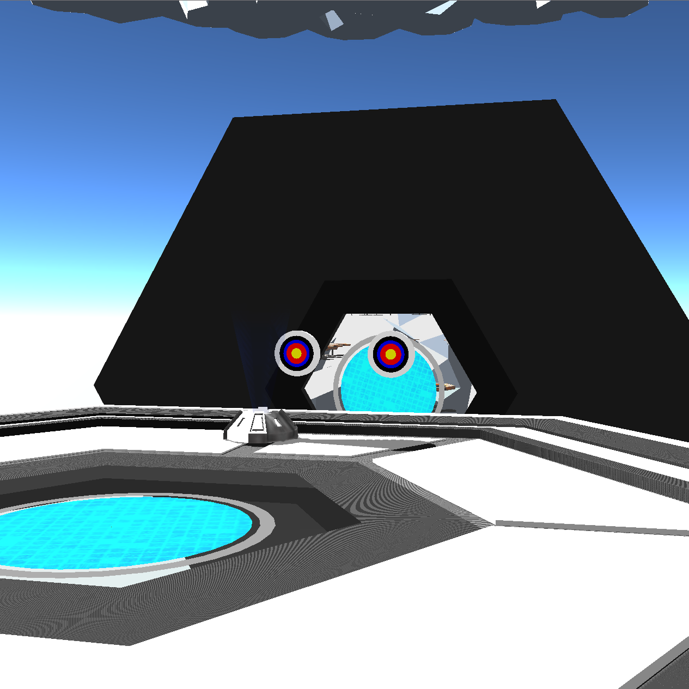
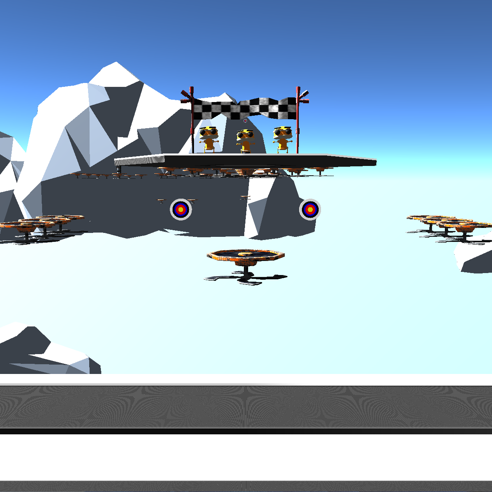
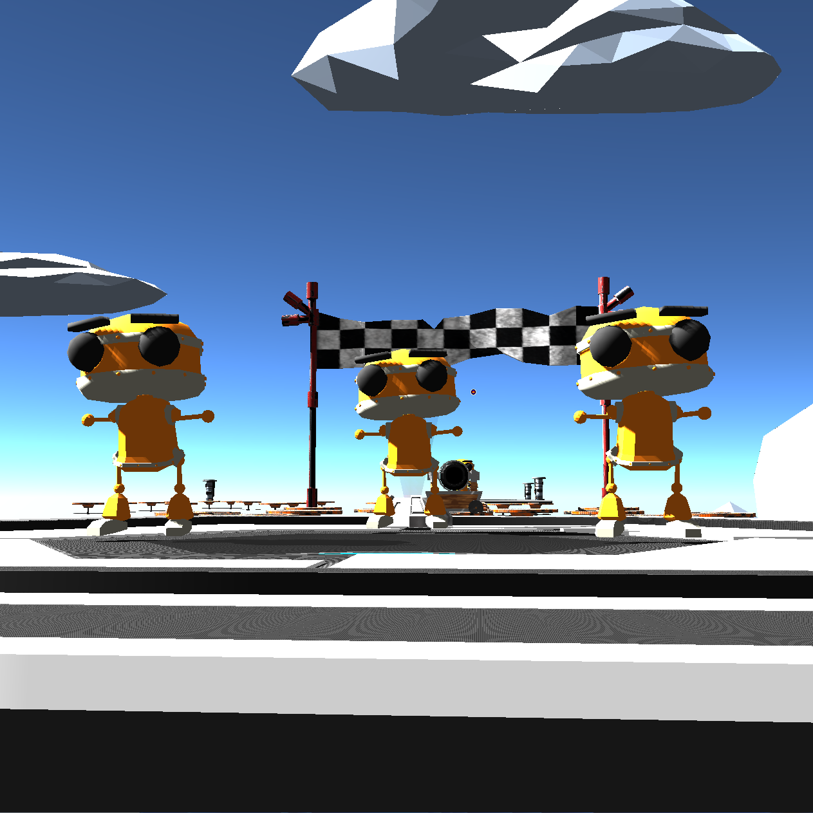
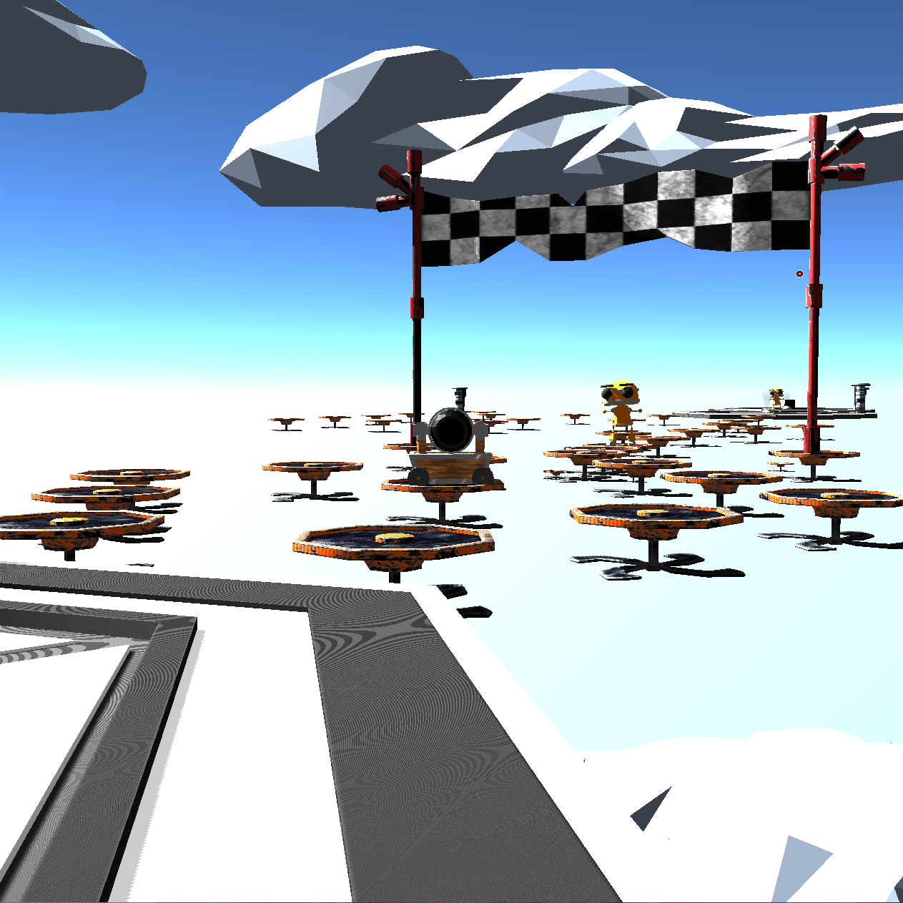
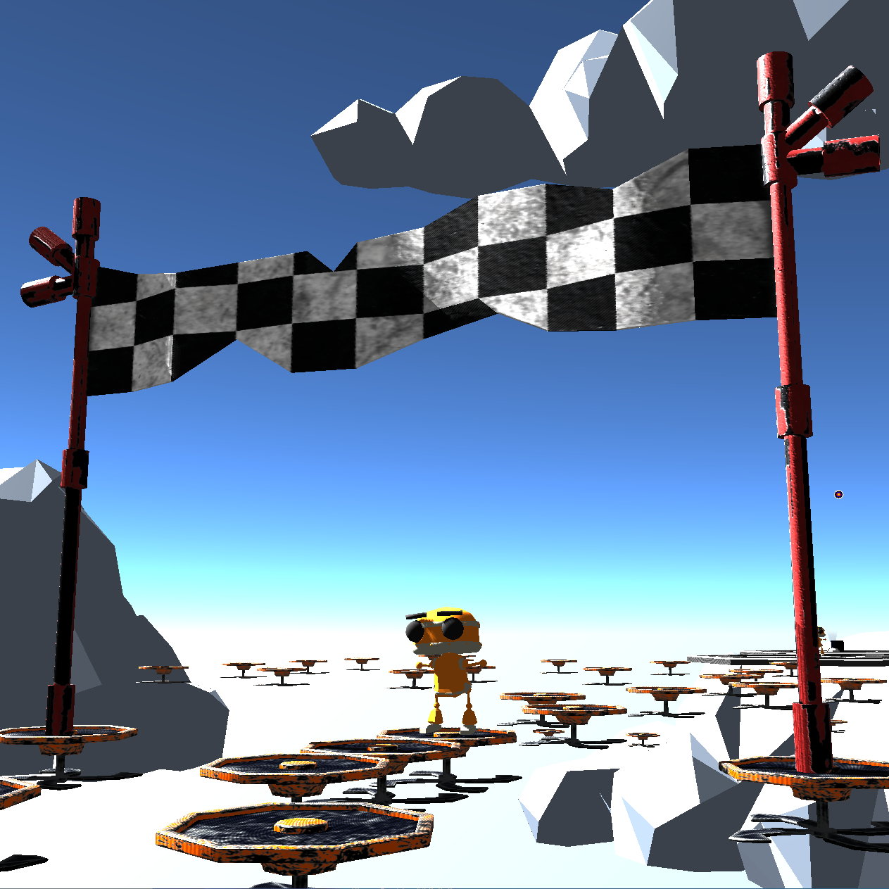
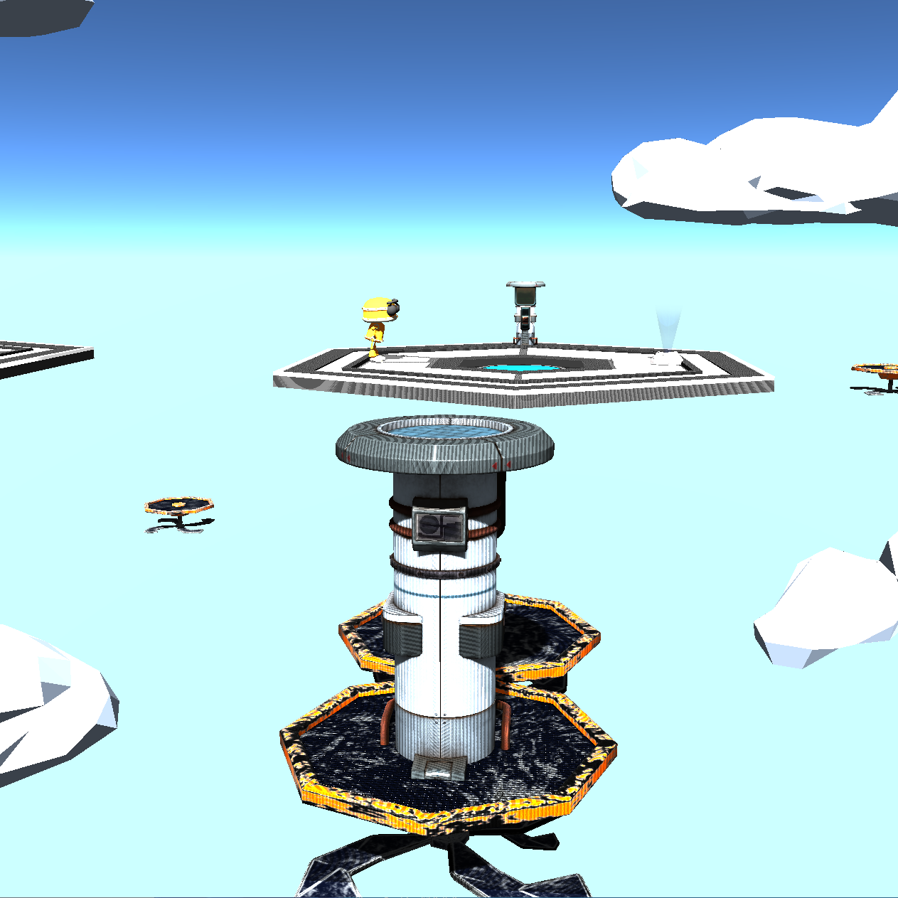
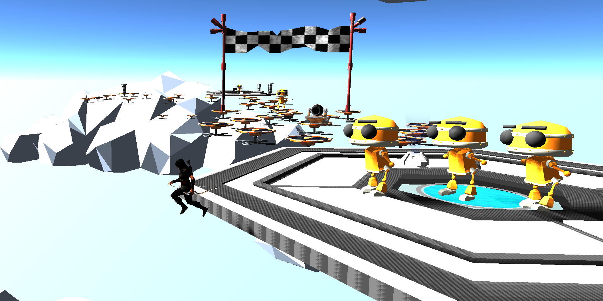
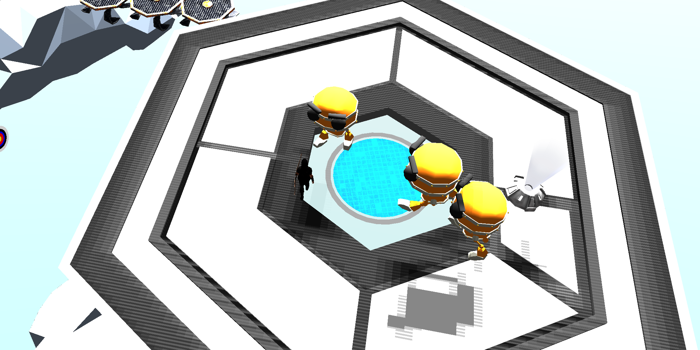
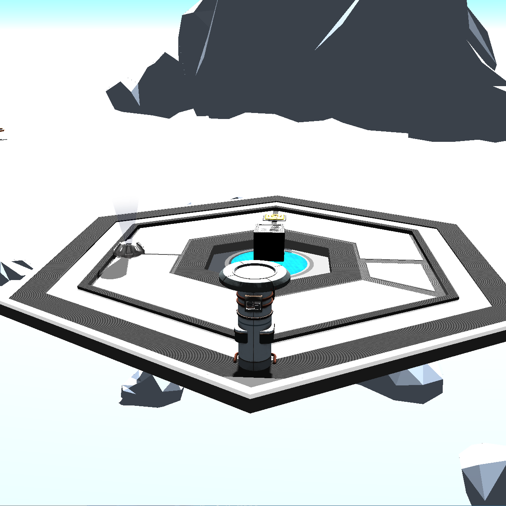

<b>TheArcher</b>  
TheArcher is third person shooter game developed as a final project for the 2022 Interactive Graphics course in Sapienza.  
<u><b>You can try it immediately at the following [LINK](https://sapienzainteractivegraphicscourse.github.io/final-project-rm/menu.html "Github pages of the project").</b></u>    It is fully based on the following Javascript libraries:  <i>(click on the images to reach the corresponding websites)</i>
<ul>
  <li></li>
  <li style="margin-top:10px; margin-bottom: 10px;"><a href="https://github.com/pmndrs/cannon-es">Cannon-ES</a><i> (no logo available)</i></li>
  <li></li>
</ul> 
Here you can find some screenshots of the game:  

<table width="100%" style="border: none !important;">
<tr>
<td>

</td>
<td>

</td>
</tr>
<tr>
<td>

</td>
<td>

</td>
</tr>
<tr>
<td>

</td>
<td>

</td>
</tr>
<tr>
<td>

</td>
<td>

</td>
</tr>
<tr>
<td colspan="2">

</td>
</tr>
</table>

  
If you want additional info about the project read the attached <a href="./Final_Project_Report_IG_1853552.pdf">report</a>.  
<em>All the models and all the sounds in the game have been imported from external sources. Please be sure to check the report to obtain the link for every model and sound you find.</em>